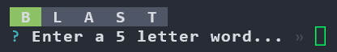
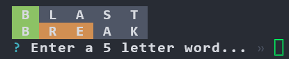
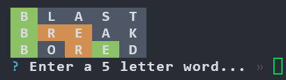
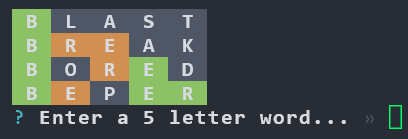
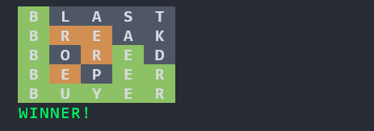

# Nodele

An implementation of the popular Wordle game in Node.js.

#### Screenshot 1

 

#### Screenshot 2

#### Screenshot 3

#### Screenshot 4

#### Screenshot 5

#### Screenshot 6

## Running

> Warning: Resizing terminal after starting will mess with the layout. 
> INFO: try to run terminal in full screen before running

### Option 1 - Dev Container

The easiest way to run the project is by opening it in a dev container using the [VS Code Remote Containers extension](https://marketplace.visualstudio.com/items?itemName=ms-vscode-remote.remote-containers&WT.mc_id=devcloud-0000-buhollan). You must also have Docker installed for this to work.

1. Open the project in VS Code.
1. Select "Reopen" from the notification in VS Code.
1. When the project opens, press <kbd>F5</kbd>.

### Option 2

This project requires Node v12 or higher.

1. Run `npm install`
1. Run `npm start`. Alternatively in VS Code, press <kbd>F5</kbd>.
